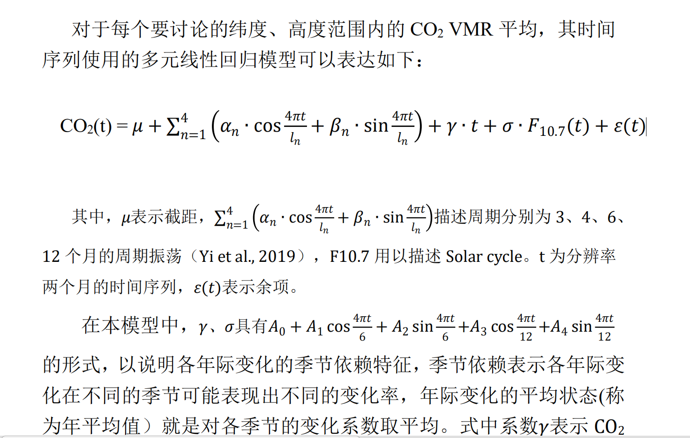
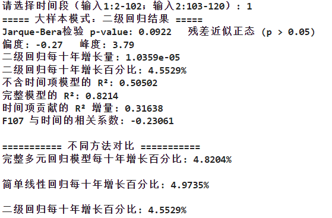
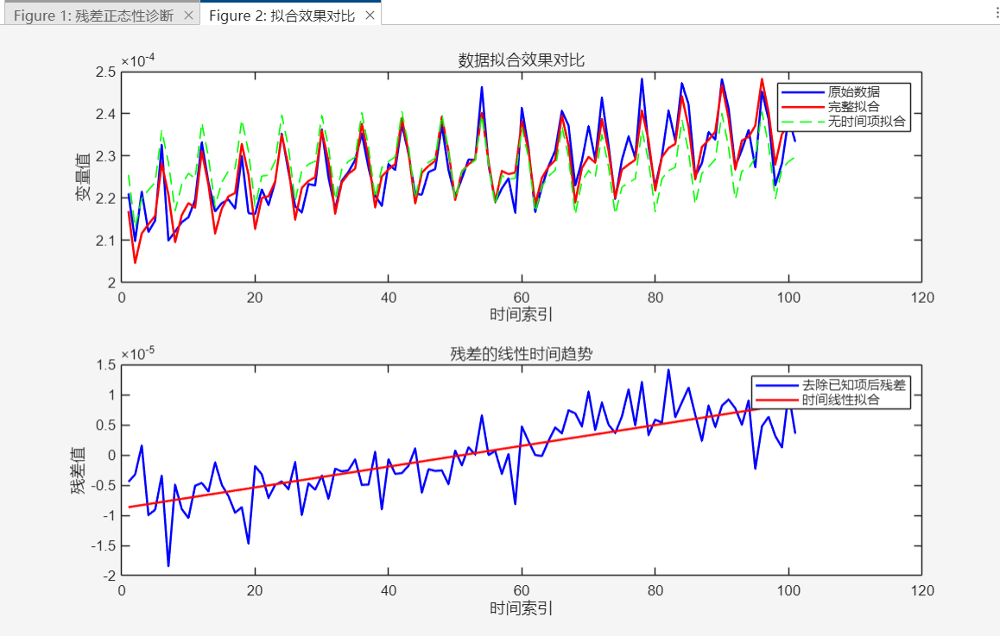
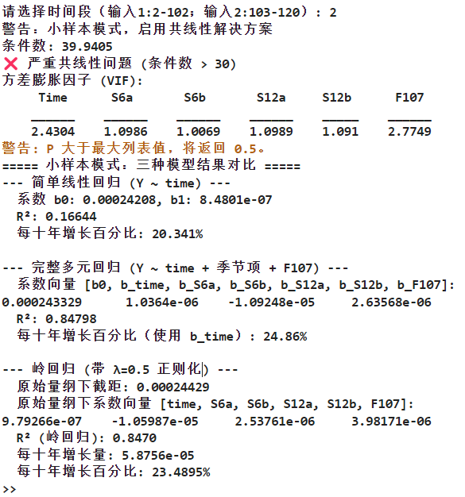

## 问题

### after.m 的问题在于：不论是简单线性回归还是多元线性回归，所求得的每十年线性增长率都是几乎一致的。

### 当遇到后三年的求解每十年线性增长，如果仅使用简单线性回归，结论约为20%；但是一旦使用多元线性回归，有以下三种情况会使得结果变化：

#### ① t的取值，是否要带三角函数周期
    t=[time , seasonality6a.*time,seasonality6b.*time, seasonality12a.*time,seasonality12b.*time];
――――42.7193%

    t=[time];
――――26.653%

#### ② 秩亏，舍弃2、3月周期
    X = [ones(xend, 1), t, ...
    seasonality3a, seasonality3b, seasonality4a, seasonality4b, ...   
    seasonality6a, seasonality6b, seasonality12a, seasonality12b, ...
    F107];
――――这种情况会导致秩亏

    X = [ones(xend, 1), t, ...
    seasonality6a, seasonality6b, seasonality12a, seasonality12b, ...
    F107];
 ――――这种情况不会秩亏，对结果的影响在1%左右（26.653% --> 27.4046%）

 #### ③ sectionmean的选择，尽管影响不大
    sectionmean=mean(mean(squeeze(mean(all_point_f(:,:,monthbegin:monthend),'omitnan')),'omitnan'),'omitnan');%
    或是
    sectionmean=mean(mean(squeeze(mean(all_point_f(:,:,1:end),'omitnan')),'omitnan'),'omitnan');

### 最主要的是 ① 中的 t 是否真的需要考虑本身的周期性变化？而且即使仅仅只取“time”,看似和简单一元线性回归更相似，但是结论依然比20%多了6.6%，这是需要澄清的。

## 解决
### 处理关键在于不能在原式里单纯的更换搭配，这边加上了t的周期项，那边又因为秩亏削减了两个周期。而是需要通过构建CO2的二级回归模型，即先不管线性项，而对于已确定的其余项（截距项、四个周期项、F10.7项）进行删去，仅仅留下时间线性项与余项，以便在不受其余项变化的情况下单独研究时间项具体是如何变化的。

### 在after1.m中，针对不同大小的时间区间分化处理。对于前17年的数据多的区间采用二级回归

### 对于后三年数据少的区间，如果采用多元回归的二级回归，则会导致时间线性项的R方贡献甚至小于0；判断出现了共线性问题，采用岭回归。

##
## 至此只能说相对于先前多元回归过程中的时间线性提取有所进步，但是更加细致的物理与统计方法审查还需要进一步进行